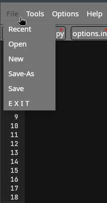
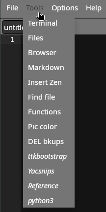
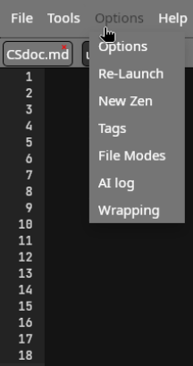

# CodeScriber — Documentation

A compact, user-focused reference for CodeScriber — a lightweight code editor built on the Ace Editor and a small Python host (pywebview). This document focuses on usage, configuration, and shortcuts. For code-level details see the project files such as `cs.py`, `cs.html`, `cs.css`, and `tags.js`.

Last updated: 2026-01-16

---

## Quickstart

- Install Python 3 and required packages (if any).
- Run the editor:
```bash
pip install -r requirements.txt        # if the repo provides requirements
python3 cs.py
# or
python3 cs.py path/to/file
```

---

## Table of Contents

- [Overview](#overview)
- [Running CodeScriber](#running-codescriber)
- [Quick Configuration (options.ini)](#quick-configuration-optionsini)
- [Zen Snippets (`tags.js`)](#zen-snippets-tagsjs)
- [Enclosing text with markup hotkeys](#enclosing-text-with-markup-hotkeys)
- [Keyboard shortcuts (summary + full reference)](#keyboard-shortcuts-summary--full-reference)
- [OpenAI integration (AI features)](#openai-integration-ai-features)
- [Spell Check](#spell-check)
- [Bookmarks](#bookmarks)
- [Menus and Tools](#menus-and-tools)
- [Windows note and troubleshooting](#windows-note-and-troubleshooting)

---

## Overview

CodeScriber is a desktop editor using web UI technologies (HTML/CSS/JavaScript) hosted with Python via `pywebview`. The editor uses the Ace Editor library for editing features. Most functionality runs locally, but some components — such as loading Ace from a CDN or the optional AI features — require Internet access.

Benefits:
- Local file access and integration via Python.
- Flexible, web-based UI that is easy to customize.
- Scripting-language based project makes extension straightforward.

Images (for reference):






---
<a name="running-codescriber"></a>
## Running CodeScriber

**Common ways to run:**

From the project root:
```bash
python3 cs.py
python3 cs.py path/to/file
```

From a script (example):
```bash
cd /path/to/CodeScriber
python3 cs.py "$1" &
# or
python3 /path/to/CodeScriber/cs.py "$1" &
```

The window geometry is saved between sessions.

---
<a name="quick-configuration-optionsini"></a>
## Quick configuration (`options.ini`)

Place settings in `options.ini`. Below are copy-paste examples.

Linux example:
```ini
# Editor options
backup=yes
terminal=xfce4-terminal --geometry 90x22+20+560 --working-directory=
filemanager=nemo --geometry 750x500+104+0
previous=yes
browser=firefox
theme=twilight
scope=/home/ml

# AI settings
openai=GPTKEY
model=gpt-5-nano
ailog=yes
aiconfirm=no
role=You are a helpful coding and technology assistant

# User applications
run1=firefox https://ttkbootstrap.readthedocs.io/en/latest
run2=/home/ml/bin/yac.sh
run3=firefox https://michaelleidel.net/ref
run4=python3 {f}
nam1=ttkbootstrap
nam2=Yacsnips
nam3=Reference
nam4=python3
```

Windows example:
```ini
backup=yes
terminal=wt -d
filemanager=explorer.exe
previous=yes
browser="C:\Program Files\BraveSoftware\Brave-Browser\Application\brave.exe"
theme=twilight
scope=C:\

openai=GPTKEY
model=gpt-5-nano
ailog=yes
aiconfirm=no
role=You are a helpful coding and technology assistant

run1=https://www.w3schools.com/
run2=cmd
run3=C:\Users\User\AppData\Local\GitHubDesktop\GitHubDesktop.exe
run4=pythonw.exe {f}
nam1=w3schools
nam2=cmd
nam3=Github
nam4=python
```

Key options explained:
- `openai`: environment variable name that contains your OpenAI API key
- `model`: model name to send to OpenAI (e.g., `gpt-4o`, `gpt-5-nano`)
- `ailog`: append AI responses to `ailog.md` (`yes|no`)
- `aiconfirm`: prompt for confirmation before sending (`yes|no`)
- `backup`: create backup files (`yes|no`)
- `terminal`, `filemanager`, `browser`: programs to run (current path appended when launched)
- `scope`: starting directory for file dialogs

---

<a name="zen-snippets-tagsjs"></a>
## Zen Snippets (`tags.js`)

Zen snippets (previously called "Zen snipits" in the older document) are stored in `tags.js`. Snippets let you type a trigger word and expand it into a code template.

Example `tags.js` JSON structure:
```json
{
  "input": "<input type=\"\" id=\"\" value=\"\" />",
  "button": "<button id=\"\">Label</button>"
}
```

Usage:
- Type the trigger word and press Alt-Z to expand.
- Or press Alt-X to choose from a list.
- Add new snippets via Options → New Snippet (saves to `tags.js`).
- After editing `tags.js`, restart CodeScriber to load new snippets.

---

<a name="enclosing-text-with-markup-hotkeys"></a>
## Enclosing text with markup hotkeys

You can define up to 10 enclosers for wrapping selected text (Ctrl-0 … Ctrl-9). Defaults are defined in `tags.js` — examples:

```javascript
var stag = [
  "<strong>,</strong>",
  "<center>,</center>",
  "<em>,</em>",
  "<code>,</code>",
  "<dt>,</dt>",
  "<dd>,</dd>",
  "<div id=''>,</div>",
  "<span id=''></span>",
  "_,_",
  "**,**"
];
```

- Apply with `Ctrl-0` through `Ctrl-9`.
- Change the current session encloser using `Ctrl-E`.
- `Alt-W` repeats the last enclosure.

---

<a name="keyboard-shortcuts-summary--full-reference"></a>
## Keyboard shortcuts — summary

A compact, grouped summary of common shortcuts. All keys are configured in `cs.html`.

**Navigation & movement**

| Action | Shortcut |
|---|---|
| Go to line | `Ctrl-L` |
| Go to next error | `Alt-E` |
| Go to previous error | `Alt-Shift-E` |
| Go to start of document | `Ctrl-Home` / `Ctrl-Shift-Home` |
| Go to end of document | `Ctrl-End` / `Ctrl-Shift-End` |
| Page down | `PageDown` |
| Scroll up/down | `Ctrl-Up` / `Ctrl-Down` |

**Selection & multi-cursor**

| Action | Shortcut |
|---|---|
| Select all | `Ctrl-A` |
| Add cursor above / below | `Ctrl-Alt-Up` / `Ctrl-Alt-Down` |
| Select more / next | `Ctrl-Alt-Left` / `Ctrl-Alt-Right` (and `Shift` variants) |
| Toggle split selection into lines | `Ctrl-Alt-L` |
| Align cursors | `Ctrl-Alt-A` |

**Editing & modification**

| Action | Shortcut |
|---|---|
| Save | `Ctrl-S` |
| Save As | `Ctrl-Shift-S` |
| Undo / Redo | `Ctrl-Z` / `Ctrl-Shift-Z` or `Ctrl-Y` |
| Duplicate selection | `Ctrl-Shift-D` |
| Remove line | `Ctrl-D` |
| Copy/move lines up/down | `Alt-Shift-Up` / `Alt-Shift-Down` (copy), `Alt-Up` / `Alt-Down` (move) |
| Indent / Outdent | `Tab` / `Shift-Tab` |
| Toggle comment / block comment | `Ctrl-/` / `Ctrl-Shift-/` |

**Folding & navigation**

| Action | Shortcut |
|---|---|
| Fold / Unfold | `Alt-L` / `Alt-Shift-L` (or `Ctrl-F1` / `Ctrl-Shift-F1`) |
| Toggle fold widget | `F2` |
| Fold other | `Alt-0` |
| Unfold all | `Alt-Shift-0` |
| Expand to matching | `Ctrl-Shift-M` |

**Search & replace**

| Action | Shortcut |
|---|---|
| Find | `Ctrl-F` |
| Find next / previous | `Ctrl-K` / `Ctrl-Shift-K` |
| Find all | `Ctrl-Alt-K` |
| Replace | `Ctrl-H` |

F**ile & application actions**

| Action | Shortcut |
|---|---|
| Open file | `Ctrl-O` |
| New file | `Ctrl-N` |
| Recent file list | `Ctrl-R` |
| Re-open active tab | `Ctrl-I` |
| Quit | `Ctrl-Q` |
| Open AI log | `Ctrl-L` |
| Execute AI prompt | `Ctrl-G` |
| Toggle word wrap | `Ctrl-Alt-W` |
| Show all shortcuts | `Ctrl-Alt-H` |
| Display enclosure keys | `Ctrl-Alt-X` |
| Run defined external command 1-4 | `Ctrl-Alt-1` … `Ctrl-Alt-4` |

**Additional / advanced keys**

| Action | Shortcut |
|---|---|
| Replace selection with Zen snippet list | `Alt-X` |
| Temporary text encloser | `Alt-E` |
| Repeat last enclosure | `Alt-W` |
| Spell check selected text | `Ctrl-Alt-C` |
| Insert Zen snippet from trigger | `Alt-Z` |
| Insert Zen tag (Zen snippet) | `Ctrl-Z` (legacy; verify local bindings) |
| Open editor command palette | `F1` |
| Bookmarks: next / clear | `F3` / `Shift-F3` |

Full, raw key mappings are defined in `cs.html`. Consider long lists as reference material and using the command palette to search keys interactively.

---

<a name="openai-integration-ai-features"></a>
## OpenAI integration (AI features)

Setup

1 Obtain an OpenAI API key: https://platform.openai.com/api-keys  
2 Set the key as a system environment variable (example for Linux/macOS):

```bash
export GPTKEY="sk-...."
```
3 In `options.ini`, set:

```ini
openai=GPTKEY
model=gpt-5-nano
ailog=yes
aiconfirm=no
role=You are a helpful coding and technology assistant
```

Usage

- Start a new document and type the prompt, then press `Ctrl-G` to send the prompt.
- Special prompt commands:
    - `log` — load the current AI log into the document
    - `new` — start a new chat conversation
    - `prompt` — return the prompt structure (contents of `prompt.txt`, if present)

Notes

- The AI features require internet access.
- Confirm whether `aiconfirm` is set to `yes` or `no` before auto-sending prompts.

Appends AI responses to `ailog.md` when `ailog=yes`.

---

<a name="spell-check"></a>
## Spell Check

- Select text and press `Ctrl-Alt-C`.
- A list of misspelled words and suggested corrections will be presented.

---

<a name="bookmarks"></a>
## Bookmarks

- Add a bookmark: `Ctrl-Click` in the gutter (line numbers area).
- Jump to next bookmark: `F3`.
- Clear all bookmarks: `Shift-F3`.

Note: bookmarks are positional and may not track after large edits.

---

<a name="menus-and-tools"></a>
## Menus and Tools

Tools menu highlights:

- Terminal — opens the terminal set in `options.ini`.
- Files — opens the file manager defined in `options.ini`.
- Browser — opens the current file in configured browser.
- Markdown — opens generated HTML for the current Markdown file.
- Insert Zen — insert a snippet from `tags.js`.
- Find File — search and open files on disk.
- Functions — navigate to functions in the current file.
- Pic color — HTML5 color picker (copies color to clipboard).
- Delete Backups — remove `bkup_*` files in active file directory.
- Run 1 … Run 4 — run configured external commands.

Options menu highlights:

- Options — open and edit `options.ini`.
- Re-Launch — restart CodeScriber to apply changes.
- New Snippet — create and append a snippet to `tags.js`.
- Tags — open `tags.js` for editing.
- File Modes — edit language file modes (`filemodes.js`).
- Open AI Log — open `ailog.md` (`Ctrl-L`).
- Wrapping — toggle word wrap for current tab (`Ctrl-Alt-W`).

Context (right-click) menu includes common actions such as Copy and some Tools commands.

---

<a name="windows-note-and-troubleshooting"></a>
## Editor configuration and preferences

Some Ace Editor configuration is set in `cs.html` (search for ACE CONFIGURE):
```javascript
// ACE CONFIGURE - set at startup
editor.$blockScrolling = Infinity;
editor.setShowPrintMargin(false);
editor.setHighlightActiveLine(false);
editor.session.setTabSize(4);
editor.session.setUseSoftTabs(true);
editor.session.setUseWrapMode(false);
```
Adjust these in `cs.html` as needed.

---

## Windows-specific note

If Microsoft Edge components (WebView2) are removed, `pywebview` may not function and CodeScriber will not run. On Windows use an installation directory such as `C:\codescriber\` and consider a wrapper `cs.cmd` containing:

```bat
@echo off
pythonw.exe cs.py
```
Use a shortcut that runs `C:\codescriber\cs.cmd`.

---

## Troubleshooting

- AI not working: confirm `openai` in `options.ini` points to a valid environment variable and that variable is set in your OS.
- Ace not loading: if offline, Ace may not load from CDN; consider bundling Ace locally.
- Windows rendering errors: ensure WebView2 / Edge runtime is installed.
- Backups: `backup=yes` creates `bkup_*` files in the active directory.
- If keyboard shortcuts look incorrect, check `cs.html` for the current bindings.

---

## END

