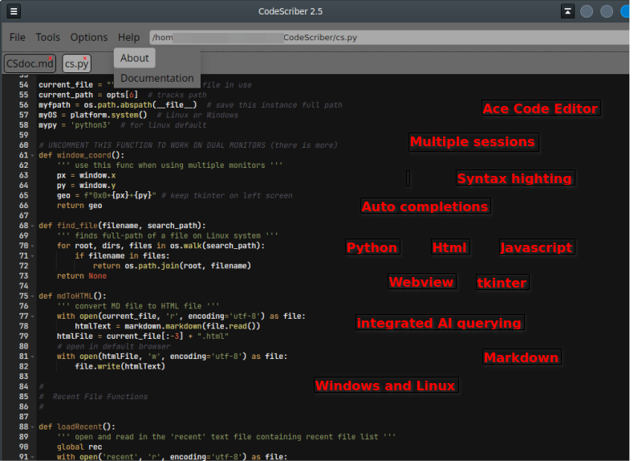
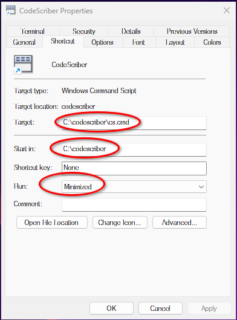
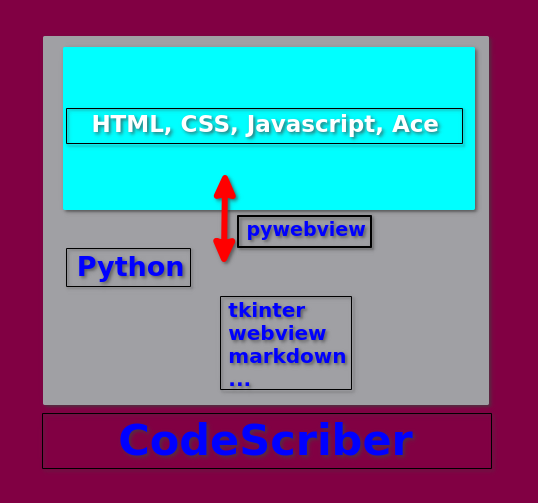

# CodeScriber Documentation

CodeScriber uses the "Ace" Code Editor - a Javascript library.

For detailed information about "Ace" visit the 
[Ace website](https://ace.c9.io/ "https://ace.c9.io/")

CodeScriber is a desktop application. All the software runs on the local machine.  
However, the "Ace" library is loaded from cdnjs.cloudflare.com,  
and the AI feature does require an Internet
connection.  

CodeScriber is written completely in scripting languages:  
HTML, CSS, Javascript, Python3, making it almost completely available to modification.

The editor resides in a python script that communicates with Javascript (Gtk WebKit2 engine,  
edgechromium for Windows) via the pywebview python module. See diagram below.  
This design allows access to the user's host machine and the use of HTML/Javascript for the GUI.

### Functions of Ace Code Editor

<table style="font-size: 9pt;">
<tr>
<td>
goToNextError - Alt-E 
goToPreviousError - Alt-Shift-E 
selectall - Ctrl-A 
centerselection - null 
gotoline - Ctrl-L 
fold - Alt-L|Ctrl-F1 
unfold - Alt-Shift-L|Ctrl-Shift-F1 
toggleFoldWidget - F2 
toggleParentFoldWidget - Alt-F2 
foldall - null 
foldAllComments - null 
foldOther - Alt-0 
unfoldall - Alt-Shift-0 
findnext - Ctrl-K 
findprevious - Ctrl-Shift-K 
selectOrFindNext - Alt-K 
selectOrFindPrevious - Alt-Shift-K 
find - Ctrl-F 
selecttostart - Ctrl-Shift-Home 
gotostart - Ctrl-Home 
selectup - Shift-Up 
golineup - Up 
selecttoend - Ctrl-Shift-End 
gotoend - Ctrl-End 
selectdown - Shift-Down 
golinedown - Down 
selectwordleft - Ctrl-Shift-Left 
gotowordleft - Ctrl-Left 
selecttolinestart - Alt-Shift-Left 
</td>
<td>
gotolinestart - Alt-Left|Home 
selectleft - Shift-Left 
gotoleft - Left 
selectwordright - Ctrl-Shift-Right 
gotowordright - Ctrl-Right 
selecttolineend - Alt-Shift-Right 
gotolineend - Alt-Right|End 
selectright - Shift-Right 
gotoright - Right 
gotopagedown - PageDown 
scrollup - Ctrl-Up 
scrolldown - Ctrl-Down 
togglerecording - Ctrl-Alt-E 
replaymacro - Ctrl-Shift-E 
jumptomatching - Ctrl-\\|Ctrl-P 
selecttomatching - Ctrl-Shift-\\|Ctrl-Shift-P 
expandToMatching - Ctrl-Shift-M 
removeline - Ctrl-D 
duplicateSelection - Ctrl-Shift-D 
sortlines - Ctrl-Alt-S 
togglecomment - Ctrl-/ 
toggleBlockComment - Ctrl-Shift-/ 
modifyNumberUp - Ctrl-Shift-Up 
modifyNumberDown - Ctrl-Shift-Down 
replace - Ctrl-H 
undo - Ctrl-Z 
redo - Ctrl-Shift-Z|Ctrl-Y 
copylinesup - Alt-Shift-Up 
movelinesup - Alt-Up 
</td>
<td>
copylinesdown - Alt-Shift-Down 
movelinesdown - Alt-Down 
backspace - Shift-Backspace|Backspace 
cut_or_delete - Shift-Delete 
removetolinestart - Alt-Backspace 
removetolineend - Alt-Delete 
removetolinestarthard - Ctrl-Shift-Backspace 
removetolineendhard - Ctrl-Shift-Delete 
removewordleft - Ctrl-Backspace 
removewordright - Ctrl-Delete 
outdent - Shift-Tab 
indent - Tab 
blockoutdent - Ctrl-[ 
blockindent - Ctrl-] 
transposeletters - Alt-Shift-X 
touppercase - Ctrl-U 
tolowercase - Ctrl-Shift-U 
expandtoline - Ctrl-Shift-L 
openCommandPallete - F1 
addCursorAbove - Ctrl-Alt-Up 
addCursorBelow - Ctrl-Alt-Down 
addCursorAboveSkipCurrent - Ctrl-Alt-Shift-Up 
addCursorBelowSkipCurrent - Ctrl-Alt-Shift-Down 
selectMoreBefore - Ctrl-Alt-Left 
selectMoreAfter - Ctrl-Alt-Right 
selectNextBefore - Ctrl-Alt-Shift-Left 
selectNextAfter - Ctrl-Alt-Shift-Right 
toggleSplitSelectionIntoLines - Ctrl-Alt-L 
alignCursors - Ctrl-Alt-A 
findAll - Ctrl-Alt-K 
</td>
</tr></table>

__Additional Operation:__

<table border=1 cellspacing=0 cellpadding=4>
	<tr>
		<td><b>Ctrl-S</b></td>
		<td>Save</td>
	</tr>
	<tr>
		<td><b>Ctrl-Shft-S</b></td>
		<td>Save-As</td>
	</tr>
	<tr>
		<td><b>Ctrl-Alt-C</b></td>
		<td>Spell Check Selected</td>
	</tr>
	<tr>
		<td><b>Ctrl-Z</b></td>
		<td>Insert Zen Tag</td>
	</tr>
	<tr>
		<td><b>Alt-X</b></td>
		<td>List Zen Tags</td>
	</tr>
	<tr>
		<td><b>Ctrl-Alt-F</b></td>
		<td>Find Functions</td>
	</tr>
	<tr>
		<td><b>Ctrl-Alt-H</b></td>
		<td>Display All Keyboard Shortcuts</td>
	</tr>
	<tr>
		<td><b>Ctrl-Alt-X</b></td>
		<td>Display enclosure keys</td>
	</tr>
	<tr>
		<td><b>Ctrl-Q</b></td>
		<td>Quit</td>
	</tr>
	<tr>
		<td><b>Ctrl-E</b></td>
		<td>Set up temporary text encloser</td>
	</tr>
	<tr>
		<td><b>Ctrl-G</b></td>
		<td>Fire off a GPT prompt using 
		a separate (new) document</td>
	</tr>
	<tr>
		<td><b>Ctrl-0 through 9</b></td>
		<td>Enclose with text</td>
	</tr>
	<tr>
		<td><b>Alt-W</b></td>
		<td>Repeat last text enclosure</td>
	</tr>
	<tr>
		<td><b>Ctrl-Alt-1</b></td>
		<td>Run 1 (defined in options.ini)</td>
	</tr>
	<tr>
		<td><b>Ctrl-Alt-2</b></td>
		<td>Run 2 (defined in options.ini)</td>
	</tr>
	<tr>
		<td><b>Ctrl-Alt-3</b></td>
		<td>Run 3 (defined in options.ini)</td>
	</tr>
	<tr>
		<td><b>Ctrl-Alt-4</b></td>
		<td>Run 4 (defined in options.ini)</td>
	</tr>
	<tr>
		<td><b>Ctrl-R</b></td>
		<td>Recent File List</td>
	</tr>
	<tr>
		<td><b>Ctrl-O</b></td>
		<td>Open a file</td>
	</tr>
	<tr>
		<td><b>Ctrl-N</b></td>
		<td>New file</td>
	</tr>
	<tr>
		<td><b>F1</b></td>
		<td>Command Pallete</td>
	</tr>
	<tr>
		<td><b>F3</b></td>
		<td>Next Bookmark</td>
	</tr>
	<tr>
		<td><b>Shift-F3</b></td>
		<td>Clear Bookmarks</td>
	</tr>
</table>

_All event keys are coded in the cs.html file._

- Ctrl-Alt-H displays all keyboard hot keys except Ctrl-0..9 text enclosures

- Right-Click on file tab closes tab.

- Right-Click in editor opens contextmenu.

---

## *Zen*

The file `tags.js` holds some tags for use with the Zen tag insert feature (Alt-Z.)

To use: type in the "command" word and hit Alt-Z. The word is replaced by the code 
associated with the command.

Use the Options menu **Tags** to view and modify the `tags.js` file.

        const atags = {
          "command": "output",
          "command": "output",
          "command": "output",
        };

_Example_  
in tags.js enter a new item to the json array:

        "input": "<input type='' id='' value='' />",

In the editor, type __input__ and press **Alt-Z**  
`input` is replaced by `<input type='' id='' value='' />`

### New Snipits

Creating a new Zen snipit is very easy.  
In the menu click on "Options" --> "New Snipit".  
Enter a _trigger word_ that you will use with Ctrl-Z to insert the snip of code.  
Enter the code to be inserted with the _trigger word_.  
Hit Save (Ctrl-S).

The new snipits will not be available to use until CodeScriber is re-launched.

View and edit/delete snipits from the `tags.js` file.

---

## Enclosing text with markup hotkeys

There is an array to hold up to 10 (0-9) surrounding markup texts.  
Defaults are set in the `tags.js` file.  
Use the Options menu **Tags** to view the `tags.js` file and modify it.

        var stag = ["<strong>,</strong>",
                    "
,
",
                    "<em>,</em>",
                    "<code>,</code>",
                    "<dt>,</dt>",
                    "<dd>,</dd>",
                    "
,
",
                    "",
                    "_,_",
                    "**,**"];

Apply these to selected text using **Ctrl-0,1,2,...9**  
Change any of them for current session using **Ctrl-E**.  

---

_When working with Markdown, HTML is **generated on every save**._  
Use the Tools menu "**Markdown**" to open the HTML in a browser for review.  
There after refresh the browser whenever the markdown is saved.  
This Markdown follows rules from the 
[Markdown 3.7](https://pypi.org/project/Markdown/ "markdown module") python3 module.

---

## Bookmarking?

To bookmark a line of code use **Ctrl-Click in the "gutter"** (where the line numbers are)  
To travel through the bookmarks use **F3**.  
To clear all bookmarks use **Shift-F3**.

_Note: bookmarks will be incorrect when lines are added or deleted._

---

## AI coding query

#### Setup

The advent of AI chat completion engines has definitely changed the art of computer programming.
This implementation requires an OpenAI API [key](https://platform.openai.com/api-keys "OpenAI").
Set up your key as a system environment variable and then put the variable name in the _options.ini_ file,
like _openai=MYKEY_.
The OpenAI model must also appear in the _options.ini_ file, like _model=GPT-4o_.  

#### Prompt and Query

To run an AI query open a "New" tab and construct your prompt. When finished hit Ctrl-G.
In a few seconds your response will fill the page.

---

## Spell Check

To spell check some text first select the text. Then hit Ctrl-Alt-C. You will get a list of
miss-spelled words and possible corrections.

---
## options.ini

**CodeScriber options**

    ailog=yes
    backup=yes
    terminal=gnome-terminal --working-directory=
    filemanager=thunar
    previous=yes
    browser=firefox
    theme=twilight
    scope=/home/UsEr
    openai=GPTKEY
    model=o1-mini
    run1=/blah/blahh/CodeSnips/csnips.py
    run2=gnome_terminal -e htop
    run3=python3 {f}
    run4=https://www.w3schools.com/
    nam1=CSnips
    nam2=htop
    nam3=python3
    nam4=w3schools

The Windows options.ini could look more like this:

    ailog=yes
    backup=yes
    terminal=wt -d
    filemanager=explorer.exe
    previous=yes
    browser="C:\Program Files\BraveSoftware\Brave-Browser\Application\brave.exe"
    theme=monokai
    scope=C:\
    openai=GPTKEY
    model=o1-mini
    run1=https://www.w3schools.com/
    run2=cmd
    run3=C:\Users\User\AppData\Local\GitHubDesktop\GitHubDesktop.exe
    run4=calc.exe
    nam1=w3schools
    nam2=cmd
    nam3=GitHub
    nam4=Calculator

**ailog**
>Append OpenAI reponses to `ailog.md` **yes|no**

**backup**
>Create a backup of opened files **yes|no**

**terminal**
>Enter your terminal preference and the option to  
start at a specific working directory.  
Current path will be added as final argument.

**filemanager**
>The name of your systems file manager executable file.  
Current path will be added as final argument.

**previous**
>Open last file at start-up **yes|no**

**browser**
>The executable of the browser you wish to use.  
**Default** if you want to use your system default browser.

**scope**
>Set the _starting directory_ in your file system that CodeScriber should use.

**openai**
>Environment variable for your OpenAI key  
[about OpenAI keys](https://platform.openai.com/settings/organization/api-keys "OpenAI keys")

**model**
>The model to use for the OpenAI API  
[about OpenAI models](https://platform.openai.com/docs/models "OpenAI")

**run1 ... run2**
>External programs you might want to execute via menus or
_Ctrl -_ and _Ctrl =_ respectively.

**run3 ... run4**
>External programs you might want to execute via menus or
_Alt -_ and _Alt =_ respectively.

**theme**
>Editor theme name for all file types.  
COLOR THEMES:  
monokai | cobalt | vibrant_ink | clouds_midnight | solarized_dark  
tomorrow_night_eighties | twilight | kr_theme | Terminal  
solarized_light | textmate | tomorrow_night

**Notes:** Non URL Run# items are implemented with a simple os.system() method.  
Make sure your executable is in your system path or supply it with a fullpath.  
A URL is opened in your system's default browser.

The **font family** and **size** are set in the cs.css file under #editor. 

---

Some additional **editor options** can be found in the `cs.html` file (around line 150).  

    // ACE CONFIGURE - set at startup
    editor.$blockScrolling = Infinity;  // ace debug suggestion
    editor.setShowPrintMargin(false);
    editor.setHighlightActiveLine(false);
    editor.session.setTabSize(4);
    editor.session.setUseSoftTabs(true); // use spaces instead of tab chars
    editor.session.setUseWrapMode(false);

[more info...](https://ace.c9.io/#nav=howto "Ace Editor Options")

---

## Menus

### Tools menu

- **Terminal**  
  Open a terminal as designated in the _options.ini_

- **Files**  
  Open your file manager as designated in the _options.ini_ 

- **Browser**  
  Open current file with the browser specified in _options.ini_

- **Markdown**  
  Open your markdown document's compiled HTML in your browser.  
  Each save of a markdown document generates it's HTML file.

- **Find File**  
  Find (and open) a file anywhere on the system

- **Find Function**
  Goto fuction from list _(most languages)_

- **Run 1 ... Run 4**   
  Executes an external process as designated in _options.ini_

**_The context menu repeats some of the tools menu and "Copy"_**

### Options menu

Changes will not take effect until CodeScriber is re-started.   

- **Options**  
  Open the `options.ini` file for editing various options

- **Tags**  
  Open the `tags.js` file for editing the various tags and options

- **File Modes**  
  Open the `filemodes.js` file for editing language modes

- **Open AI Log**  
  Open the `ailog.md` file for editing or viewing

- **New Snipit**  
  Opens the Zen Snipit template for entering a new code snipit

- **Re-Launch**  
  Closes and re-opens CodeScriber activating any changes to the Options

- **Wrapping**
  Toggles word wrap for current session (tab)

## Note for Windows Users

If you uninstall Microsoft Edge or any of its components, CodeScriber will not work.  
This is because pywebview uses some Edge components for rendering.

---

## Running CodeScriber

There's always more than one way, but here are some suggestions.

<code>
$>python3 cs.py  
$>python3 cs.py fileToOpen
</code>

bash file:  
<code>
>cd /home/user/ ... /codescriber  
>python3 cs.py $1 &  
**or**  
>python3 /home/user/ ... /CodeScriber/cs.py $1 &  
</code>
---

**The geometry of CodeScriber's window is saved.**

---

### on Windows

Suggest to use `C:\codescriber\` for location.

Create a CMD command file, like `cs.cmd` that contains:    
`pythonw.exe cs.py`

To execute:  
`C:/codescriber/cs.cmd`

For a shortcut use:  

---

> 
