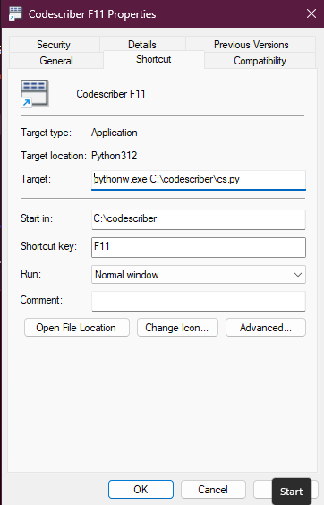

# CodeScriber Documentation

CodeScriber uses the "Ace" Code Editor - a Javascript library.

For detailed information about "Ace" visit the 
[Ace website](https://ace.c9.io/ "https://ace.c9.io/")

CodeScriber is a desktop application. All the software resides on the local machine.  
However, the "Ace" library is loaded from a CDN. This editor is written completely in  
scripting languages: HTML, CSS, Javascript, Python3, making CodeScriber almost completely hack-able.

CodeScriber is _housed_ in a python script that communicates with the HTML (Gtk WebKit2 engine,  
edgechromium for Windows) via the pywebview python module. See diagram below.  
This design provides access to both the Internet and the user's host machine.

__Additional Hotkeys:__

<table border=1 cellspacing=0>
	<tr>
		<td><b>Ctrl-S</b></td>
		<td>Save</td>
	</tr>
	<tr>
		<td><b>Ctrl-Shft-S</b></td>
		<td>Save-As</td>
	</tr>
	<tr>
		<td><b>Ctrl-Z</b></td>
		<td>Insert Zen Tag</td>
	</tr>
	<tr>
		<td><b>Alt-X</b></td>
		<td>List Zen Tags</td>
	</tr>
	<tr>
		<td><b>Ctrl-Alt-H</b></td>
		<td>Display All Keyboard Shortcuts *</td>
	</tr>
	<tr>
		<td><b>Ctrl-Alt-X</b></td>
		<td>Display enclosure keys</td>
	</tr>
	<tr>
		<td><b>Esc</b></td>
		<td>Quit</td>
	</tr>
	<tr>
		<td><b>Ctrl-Q</b></td>
		<td>Quit</td>
	</tr>
	<tr>
		<td><b>Ctrl-G</b></td>
		<td>Set up a text encloser</td>
	</tr>
	<tr>
		<td><b>Ctrl-0 through 9</b></td>
		<td>Enclose with text</td>
	</tr>
	<tr>
		<td><b>Ctrl -</b></td>
		<td>Run 1 (see tags.js)</td>
	</tr>
	<tr>
		<td><b>Ctrl =</b></td>
		<td>Run 2 (see tags.js)</td>
	</tr>
	<tr>
	<tr>
		<td><b>Alt -</b></td>
		<td>Run 3 (see tags.js)</td>
	</tr>
	<tr>
		<td><b>Alt =</b></td>
		<td>Run 4 (see tags.js)</td>
	</tr>
	<tr>
		<td><b>Alt-W</b></td>
		<td>Repeat last text enclosure</td>
	</tr>
	<tr>
		<td><b>Ctrl-R</b></td>
		<td>Recent File List</td>
	</tr>
	<tr>
		<td><b>Ctrl-o</b></td>
		<td>Open a file</td>
	</tr>
</table>

Right-Click on file tab will close tab.  
Right-Click also opens contextmenu.

### Functions of Ace Code Editor

<table style="font-size: 9pt;">
<tr>
<td>
goToNextError - Alt-E 
goToPreviousError - Alt-Shift-E 
selectall - Ctrl-A 
centerselection - null 
gotoline - Ctrl-L 
fold - Alt-L|Ctrl-F1 
unfold - Alt-Shift-L|Ctrl-Shift-F1 
toggleFoldWidget - F2 
toggleParentFoldWidget - Alt-F2 
foldall - null 
foldAllComments - null 
foldOther - Alt-0 
unfoldall - Alt-Shift-0 
findnext - Ctrl-K 
findprevious - Ctrl-Shift-K 
selectOrFindNext - Alt-K 
selectOrFindPrevious - Alt-Shift-K 
find - Ctrl-F 
selecttostart - Ctrl-Shift-Home 
gotostart - Ctrl-Home 
selectup - Shift-Up 
golineup - Up 
selecttoend - Ctrl-Shift-End 
gotoend - Ctrl-End 
selectdown - Shift-Down 
golinedown - Down 
selectwordleft - Ctrl-Shift-Left 
gotowordleft - Ctrl-Left 
selecttolinestart - Alt-Shift-Left 
</td>
<td>
gotolinestart - Alt-Left|Home 
selectleft - Shift-Left 
gotoleft - Left 
selectwordright - Ctrl-Shift-Right 
gotowordright - Ctrl-Right 
selecttolineend - Alt-Shift-Right 
gotolineend - Alt-Right|End 
selectright - Shift-Right 
gotoright - Right 
gotopagedown - PageDown 
scrollup - Ctrl-Up 
scrolldown - Ctrl-Down 
togglerecording - Ctrl-Alt-E 
replaymacro - Ctrl-Shift-E 
jumptomatching - Ctrl-\\|Ctrl-P 
selecttomatching - Ctrl-Shift-\\|Ctrl-Shift-P 
expandToMatching - Ctrl-Shift-M 
removeline - Ctrl-D 
duplicateSelection - Ctrl-Shift-D 
sortlines - Ctrl-Alt-S 
togglecomment - Ctrl-/ 
toggleBlockComment - Ctrl-Shift-/ 
modifyNumberUp - Ctrl-Shift-Up 
modifyNumberDown - Ctrl-Shift-Down 
replace - Ctrl-H 
undo - Ctrl-Z 
redo - Ctrl-Shift-Z|Ctrl-Y 
copylinesup - Alt-Shift-Up 
movelinesup - Alt-Up 
</td>
<td>
copylinesdown - Alt-Shift-Down 
movelinesdown - Alt-Down 
backspace - Shift-Backspace|Backspace 
cut_or_delete - Shift-Delete 
removetolinestart - Alt-Backspace 
removetolineend - Alt-Delete 
removetolinestarthard - Ctrl-Shift-Backspace 
removetolineendhard - Ctrl-Shift-Delete 
removewordleft - Ctrl-Backspace 
removewordright - Ctrl-Delete 
outdent - Shift-Tab 
indent - Tab 
blockoutdent - Ctrl-[ 
blockindent - Ctrl-] 
transposeletters - Alt-Shift-X 
touppercase - Ctrl-U 
tolowercase - Ctrl-Shift-U 
expandtoline - Ctrl-Shift-L 
openCommandPallete - F1 
addCursorAbove - Ctrl-Alt-Up 
addCursorBelow - Ctrl-Alt-Down 
addCursorAboveSkipCurrent - Ctrl-Alt-Shift-Up 
addCursorBelowSkipCurrent - Ctrl-Alt-Shift-Down 
selectMoreBefore - Ctrl-Alt-Left 
selectMoreAfter - Ctrl-Alt-Right 
selectNextBefore - Ctrl-Alt-Shift-Left 
selectNextAfter - Ctrl-Alt-Shift-Right 
toggleSplitSelectionIntoLines - Ctrl-Alt-L 
alignCursors - Ctrl-Alt-A 
findAll - Ctrl-Alt-K 
</td>
</tr></table>

## *Zen*

The file `tags.js` holds some tags for use with the Zen tag insert feature (Alt-Z.)

To use: type in the "command" word and hit Alt-Z. The word is replaced by "output".

Use the Options menu **Tags** to view the `tags.js` file and modify it.

<code>
  const atags = { 
  	"command": "output", 
  	"command": "output", 
  	"command": "output", 
  }; 
</code>

Example:  
<code>
`"input": "<input type='' id='' value='' />",`
</code> 
In the editor, type __input__ and press **Alt-Z**  
'input' is replaced by `<input type='' id='' value='' />`

The program **fzen.py** will reformat any formated code you've copied into the clipboard, ask for a tag name, and then
append it to the tags.js file correctly formated.  
Run fzen.py from a terminal.

---

## Enclosing text with markup hotkeys

There is an array to hold up to 10 (0-9) surrounding markup texts.  
Defaults are set in the `tags.js` file.  
Use the Options menu **Tags** to view the `tags.js` file and modify it.

        var stag = ["<strong>,</strong>",
                    "
,
",
                    "<em>,</em>",
                    "<code>,</code>",
                    "<dt>,</dt>",
                    "<dd>,</dd>",
                    "
,
",
                    "",
                    "_,_",
                    "**,**"];

Apply these to selected text using **Ctrl-0,1,2,...9**  
Change any of them for current session using **Ctrl-G**.  

---

**When working with Markdown, HTML is _generated on every save_.**  
Use the Tools menu "**Markdown**" to open the HTML in a browser for review.  
There after refresh the browser whenever the markdown is saved.  
This Markdown follows rules from the 
[Markdown 3.7](https://pypi.org/project/Markdown/ "markdown module") python3 module.

---

## Tools menu external program names

Names to go with run1 ... run4 which you set up in options.ini
Default names are set in the `tags.js` file.
Use the Options menu **Tags** to view the `tags.js` file and modify it.

        var menu = {
            run1: "GptGUI",
            run2: "CSnips",
            run3: "KSnip",
            run4: "Reference"
        };

---

## Bookmarking

To bookmark a line in the code use **Ctrl-Click in the "gutter"** (where the line numbers are)  
To travel through the bookmarks use **F3**.  
To clear all bookmarks use **Shift-F3**.

---
## options.ini

**CodeScriber options**

    future1
    future2
    terminal=gnome-terminal --working-directory=
    filemanager=thunar
    previous=yes
    browser=firefox
    scope=/home/UsEr
    run1=/blah/blahh/CodeSnips/csnips.py
    run2=gnome_terminal -e htop
    run3=python3 {f}
    run4=ruby {f}

The Windows options.ini could look more like this:

    future1
    future2
    terminal=wt -d
    filemanager=explorer.exe
    previous=yes
    browser="C:\Program Files\BraveSoftware\Brave-Browser\Application\brave.exe"
    scope=C:\
    run1=https://www.w3schools.com/
    run2=cmd
    run3=C:\Users\User\AppData\Local\GitHubDesktop\GitHubDesktop.exe
    run4=calc.exe

**terminal**
>Enter your terminal preference and the option to  
start at a specific working directory.

**filemanager**
>The name of your systems file manager executable file.

**previous**
>yes|no Open last file at start-up.

**browser**
>The executable of the browser you wish to use.
Default if you want to use your system default browser.

**scope**
>Set the "root" in your file system that CodeScriber should use.

**run1 ... run2**
>External programs you might want to execute via menus or
_Ctrl -_ and _Ctrl =_ respectively.

**run3 ... run4**
>External programs you might want to execute via menus or
_Alt -_ and _Alt =_ respectively.

**Notes:** Non URL items are implemented with a simple os.system() method.  
Make sure your executable is in your system path or supply it with a fullpath.  
A URL is opened in your system's default browser.

---

## Menus

### Tools menu

- **Terminal**  
  Open a terminal as designated in the _options.ini_

- **Files**  
  Open your file manager as designated in the _options.ini_ 

- **Browser**  
  Open current file with the browser specified in _options.ini_

- **Markdown**  
  Open your markdown document's compiled HTML in your browser.  
  Each save of a markdown document generates it's HTML file.

- **Find File**  
  Find (and open) a file anywhere on the system

- **Run 1 ... Run 4**   
  Executes an external process as designated in _options.ini_

**_The context menu is a repeat of the tools menu and some File menu items._**

### Options menu

Changes will not take effect until CodeScriber is re-started.   

- **Options**  
  Open the `options.ini` file for editing various options

- **Tags**  
  Open the `tags.js` file for editing the various tags and options

- **File Modes**  
  Open the `filemodes.js` file for editing languages and themes

- **Re-Launch**  
  Closes and re-opens CodeScriber activating any changes to the Options

## Note for Windows Users

If you uninstall Microsoft Edge or any of its components, CodeScriber will not work.  
This is because pywebview uses Edge components for rendering.

---

## Running CodeScriber

Example:

<code>
$>python3 cs.py  
$>python3 cs.py fileToOpen.c  
</code>

or with a command file:  
<code>
>\# cs  
>cd /home/user/ ... /codescriber  
>python3 cs.py $1 &
</code>

><code>
>$>cs  
>$>cs fileToOpen.c
></code>

The geometry of CodeScriber's window dimensions are remembered.

### on Windows

Suggest to use `C:\codescriber\` as location for files.

Create a CMD command file, like `cs.cmd` that contains:    
`pythonw.exe cs.py`

To execute:  
`C:/codescriber/cs.cmd`

For a shortcut use:  

---

> 
