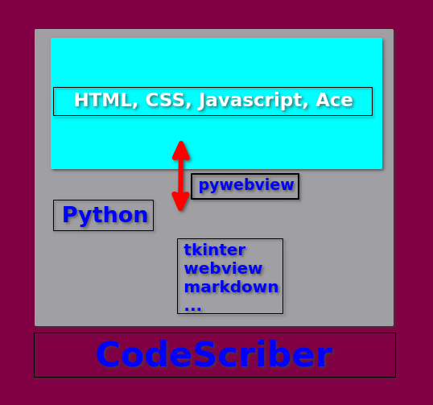

# CodeScriber

## A Desktop Code Editor for Linux and Windows

__Uses "web app" technology via Python, pywebview, Ace Code Editor API__

>

CodeScriber uses the "Ace" Code Editor - a Javascript library.

For detailed information about "Ace" visit the 
[Ace website](https://ace.c9.io/ "https://ace.c9.io/")

CodeScriber is a desktop application. All the software runs on the local machine.  
However, the "Ace" library is loaded from cdnjs.cloudflare.com,  
and the AI feature does require an Internet
connection.  

CodeScriber is written completely in scripting languages:  
HTML, CSS, Javascript, Python3, making it almost completely available to modification.

The editor resides in a python script that communicates with Javascript (Gtk WebKit2 engine,  
edgechromium for Windows) via the pywebview python module. 
This design allows access to the user's host machine and the use of HTML/Javascript for the GUI.

_See_ <a href='https://ace.c9.io/'>https://ace.c9.io</a> _for information on the Ace Code Editor._

### Features:

- Syntax highlighting
- Multi Session Interface
- OpenAI chat compleation for coding
- Auto indentation and outdent
- An optional command line
- Work with large documents (handles hundreds of thousands of lines without issue)
- Fully customizable key bindings including vi and Emacs modes
- Themes and many language models
- Search and replace with regular expressions
- Highlight matching parentheses
- Toggle between soft tabs and real tabs
- Displays hidden characters
- Highlight selected word
- Multiple cursor selection
- Column select and edit mode
- Customizable Keyword code snipits
- Drag & Drop to open file
- Markdown
- Spell check
- Find File
- Sort
- Recent Files
- Context Menu
- Optional file backups
- Snipit Management

[Documentation](CSdoc.md "Doc")

### CodeScriber combines the following technologies:
> - python (pywebview, markdown, tkinter.ttk)
> - javascript
> - API (ace.js)
> - css
> - html

### Default language modes:
> _python, c, html, css, markdown, javascript, bash, sql, golang, json_  
Modify this list in `filemodes.js` - see **File Modes** under Options menu.

[Documentation](CSdoc.md "Doc")

---

